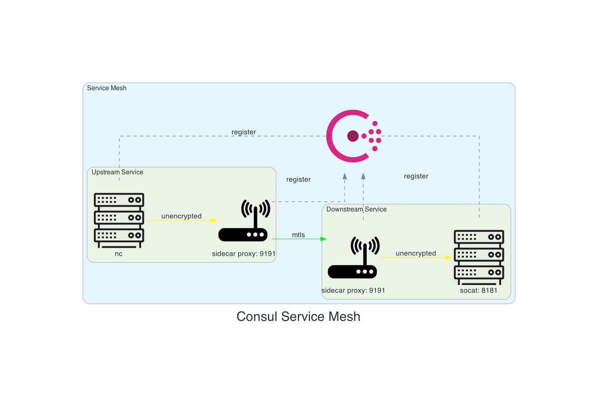

# Demo Consul Connect

Learning Consul Connect and applying it.

## Quickstart

Run the following commands in separate terminals:

1. Install prerequisites: `make setup`
1. Start consul, upstream service, downstream service: `make start`
   - Logs are stored in the [folder](./logs/).
1. Test the service mesh: `make test-service-mesh`

## Configuration



### Consul

#### Upstream Service - socat

Register sidecar process for the service in [socat.json](./consul.d/socat.json):

```json
{ ... "connect": { "sidecar_service": {} } }
```
This empty configuration notifies Consul to register a sidecar proxy
for this process on a dynamically allocated port.
It also creates reasonable defaults
that Consul will use to configure the proxy
once you start it via the CLI.

Consul does _not automatically start the proxy_ process for you.
This is because Consul Connect service mesh allows you to chose the proxy you'd like to use.

Consul comes with a L4 proxy for testing purposes,
and first-class support for Envoy,
which you should use for production deployments and layer 7 traffic management.
The Consul L4 proxy doesn't have the L7 capabilities necessary
for the observability and traffic shaping features
available in Consul versions 1.5 and higher.

Use to start the Consul included L4 proxy sidecar:
- `make service-sidecar-socat`

NOTE: The `-sidecar-for` argument takes a Consul service ID, _not a service name_.

#### Downstream Service - nc

Register downstream service using [web.json](./consul.d/web.json).
It specifies web's upstream dependency on socat, and the port that the proxy will listen on.

The definition includes an upstream block.
Upstreams are ports on the local host
that will be proxied to the destination service.
The upstream block's local_bind_port value is the port your service
will communicate with to reach the service you depend on.

It registers a sidecar proxy for the service web
that will listen on port 9191
to establish mTLS connections to socat.

This will not start the sidecar, but only informs consul about its existence.
Use:
- `make service-sidecar-web`
to start the sidecar proxy.

If we were running a real web service it would talk to its proxy on a loopback address.
The proxy would encrypt its traffic and
send it over the network to
the sidecar proxy for the socat service.

Socat's proxy would decrypt the traffic and
send it locally to socat
on a loopback address at port 8181.

Because there is no web service running,
you will pretend to be the web service by
talking to its proxy on the port that we specified (9191).

In production,
_services should only accept loopback connections_.
Any traffic in and out of the machine
should travel through the proxies and
therefore would always be encrypted.

## Intentions

[Intentions](https://www.consul.io/docs/connect/intentions.html) allow you to segment your network
much like traditional firewalls,
but they _rely on the services' logical names_
rather than the IP addresses of each individual service instance.

In the development mode by default all is allowed.

NOTE 2020-12-28: Changing intentions will _not_ affect existing connections!
-> Will be addressed in a future version of consul.

## Envoy


### Configuration

Consul provides first class support for Envoy.
The only modification to be done is
to start the sidecar proxy using Envoy instead of the integrate Consul proxy.

Run the following commands in separate terminals:

1. Starting the envoy sidecar: `make service-sidecare-socar-envoy`
1. Starting the envoy sidecar: `make service-sidecare-web-envoy`
1. Testing the connection: `make test-service-mesh`


## Observability

Starting with version 1.5,
Consul is able to configure Envoy proxies
to collect L7 metrics including HTTP status codes and request latency,
along with many others, and
export those to monitoring tools like Prometheus.

- https://www.consul.io/docs/connect/observability/ui-visualization

## Remarks

### Development Mode

ACL system ( and hence Intentions ) are by default _Allow All_.

### Local Traffic

Connection between proxies is encrypted and authorized.
Local connection to and from the proxy are _unencrypted_ - this represents the loopback connection.
Traffic in and out of the machine is always encrypted.

The Consul Connect service mesh security model
_requires trusting loopback connections_
when you use proxies.
To further secure loopback connections
you can use tools like network namespacing.

### Socat

Only supports tcp. No support for tls.


## References

- https://learn.hashicorp.com/tutorials/consul/get-started-service-networking
- https://learn.hashicorp.com/tutorials/consul/service-mesh
- https://learn.hashicorp.com/tutorials/consul/service-mesh-production-checklist
- https://learn.hashicorp.com/tutorials/consul/service-mesh-with-envoy-proxy?in=consul/developer-mesh


## Questions

### Why are there two sidecars: sidecar-socat and sidecar-web?

1. _sidecar-socat_ represents the upstream service
1. _sidecar-web_ simulates a dependent downstream service using `nc`.
